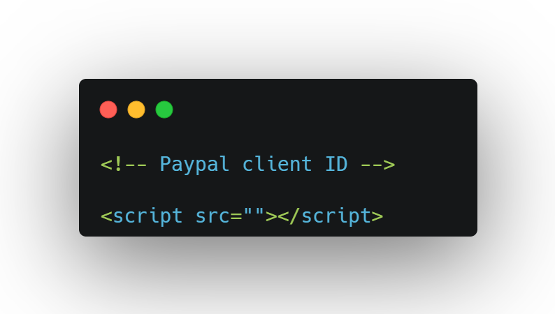

Trady is a web-based system that allows any tradesman to advertise their job and people who want to find a tradesman can also hire by searching the ads.

# Features
- Tradesman can post advertisements.
- Tradesman can manage advertisements.
- Tradesman can make payment using paypal.

- People can hire tradesman.
- People can rate advertisements.

- Admin can manage the whole system using the admin dashboard.

# Installation
In this web-based system i used paypal for payments feature in order to use this system,

1. Clone the project
2. Add your paypal client id to 'checkout.php' that is located on 'pages/checkout.php' as follows,

3. Import 'tardy.sql' file to phpmyadmin that is located on 'extras/trady.sql'

